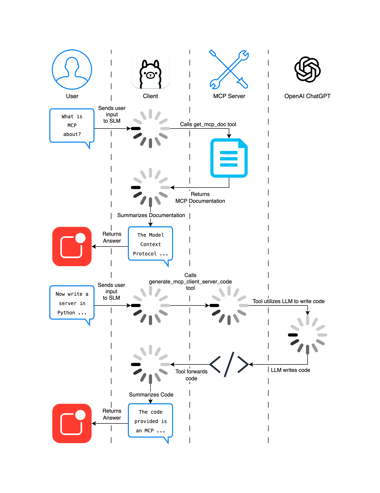

# MCP Demo

* An end-to-end MCP demo with an LLM (Large Language Model) as tool to an SLM (Small Language Model)


* In the demo we replace the OpenAI model with another SLM to enable users to run the demo without incurring cost / need of a credit card

## Quickstart

* Put the model names you would like your client and server to use in `ollama/models.txt` like such, that they can be pre-pulled

```bash
qwen3:1.7b
```

* We took some more capable models for our demo:

```bash
qwen3:4b
mistral:7b
```

* In the docker compose file `docker-compose.yml`, change the environment variable MODEL_NAME for the client and the server to be the models you would like each of them them to use.
* Run the docker containers

```bash
docker compose up
```

* Wait for the ollama container to pull the models you specified. It will log "All models are ready" once it is done.
* Then run the client application by connection to a shell on the client container

```bash
docker exec -it mcp_demo-client-1 python3 client.py
```

* Now you should see an input fiels stating: `❓  Ask about MCP or request code (type 'exit' to quit):`
* If you now type `What is MCP about?` the model will answer accordingly:

```text
<think>
Okay, the user asked, "What is MCP about?" I need to explain what MCP is. From the tools provided, there's a function called get_mcp_doc that returns a short summary. I should call that function to get the key points.

The response from the function mentions MCP as an open protocol for integrating LLMs with external data sources and tools. It talks about sharing context, exposing tools, and building composable integrations. The key details include the JSON-RPC format, stateful connections, and features like resources, prompts, and tools. Also, security considerations are mentioned, like user consent and data privacy.

I should structure the answer to highlight these points clearly. Make sure to explain what MCP does, its purpose, key components, and security aspects. Avoid technical jargon but keep it accurate. Check if the function's response has all the necessary info. Since the function returns the summary, I can use that to form the answer.
</think>

The Model Context Protocol (MCP) is an open protocol designed to enable seamless integration between language models (LLMs) and external data sources or tools. It provides a standardized way to share contextual information, expose tools and capabilities, and build composable integrations. 

### Key Features:
1. **Context Sharing**: LLMs can access contextual data (e.g., user input, tools, or resources) to generate more accurate responses.
2. **Tool Exposition**: Servers can offer tools (functions) to LLMs for execution, enabling custom workflows.
3. **Composable Integrations**: Applications can connect LLMs with other services, APIs, or data sources via a unified protocol.
4. **Security**: Emphasizes user consent, data privacy, and tool safety, ensuring secure and controlled interactions.

### Implementation:
- Uses JSON-RPC 2.0 for communication between hosts (LLM apps), clients (connectors), and servers (services).
- Requires explicit user consent for data access and tool invocation.
- Supports features like resource sharing, prompts, and sampling controls.

For implementation examples, see the [MCP documentation](https://modelcontextprotocol.io).
```

* If you now type `Now write a server in Python for me using the STDIO protocol with 2 different tools!` the model will answer accordingly
* What the SLM returns finally (it's certainly not perfect - because both models are only SLMs - but it's still demonstrating the capabilities)

````text
<think>
Okay, let me try to figure out how to help the user. They asked for a Python server using the STDIO protocol with two tools. From the previous conversation, I saw that the user wanted a server that handles tool calls and resources. The assistant provided a code snippet that's a server using STDIO, but the user might need more details or a different approach.

First, I need to check if the code is correct. The code uses the `stdio_server` from the `mcp` library, which is part of the MCP protocol. The server listens for requests on stdin and stdout. The tools are registered as functions, and the server processes requests like `tools/list` and `tools/call`.

The user might want to run this server and test it. The assistant's code includes a loop that reads from stdin, processes each line, and handles the tools. The server responds with JSON, which is standard for MCP.

But wait, the code has some issues. For example, the `stdio_server` might not be the correct way to start the server. The assistant's code uses `asyncio.run(server.start())`, which is correct for async code. However, the `stdio_server` might require specific parameters, like `--option`, which the assistant included. That's okay.

Another thing: the server is supposed to use the STDIO protocol, which is similar to JSON-RPC but with stdin/stdout. The code handles that by reading from stdin and writing to stdout. The tools are registered with `@mcp.tool()`, which is correct for MCP.

The user might want to see how to run the server and test it. The assistant's code includes a test case where the server listens for requests and processes them. The client would send requests like `add 2 3` or `multiply 4 5`, and the server returns the results.

I should make sure the code is correct and that the user understands how to run it. Also, mention that the server is simulated and doesn't connect to a real MCP server. The assistant's code is a good starting point, but maybe the user wants to see a more complete example or a client-side implementation.

Wait, the user asked for a server, not a client. The assistant provided a server code. The user might want to run it and see the output. The code includes a loop that reads from stdin and writes to stdout. The server responds to requests like `tools/list` and `tools/call`.

I should explain how to run the server and test it, maybe with an example. Also, note that the server is simulated and doesn't connect to a real MCP server. The assistant's code is correct, but the user might need to adjust the parameters or tools.

In summary, the assistant's code is correct, but the user might need to run it and test it. The code is a valid MCP server using STDIO with two tools. The assistant should confirm that the code works as intended and provide instructions on how to run it.
</think>

The code you provided is a **valid MCP server implementation** using the **STDIO transport**. It supports two tools (`add` and `multiply`) and handles standard MCP requests (e.g., `tools/list`, `tools/call`, `resources/list`, `resources/read`). Here's a breakdown of its functionality and how to run it:

---

### ✅ **Server Features**
1. **STDIO Transport**:
   - Uses standard input/output for communication.
   - Server listens for requests on stdin and writes responses to stdout.

2. **Tool Registration**:
   - `add`: Adds two numbers.
   - `multiply`: Multiplies two numbers.
   - Tools are registered using `@mcp.tool()`.

3. **Request Handling**:
   - `tools/list`: Lists available tools.
   - `tools/call`: Calls a tool with parameters.
   - `resources/list`: Lists available resources (e.g., `example.txt`).
   - `resources/read`: Reads a resource (e.g., `example.txt`).

4. **Error Handling**:
   - Simulates errors for missing tools or resources.

---

### 📦 **Requirements**
```bash
pip install mcp
```

---

### 🧪 **How to Run the Server**
1. Save the code as `add_multiply_server.py`.
2. Run the server:
   ```bash
   python add_multiply_server.py
   ```
3. The server listens for requests on stdin. You can send requests via `stdio_client` or `http-sse-client`.

---

### 📝 **Example Requests**
- **List tools**:
  ```
  {"method": "tools/list"}
  ```
  → Response: `{"tools": ["add", "multiply"], "version": "1.0.0"}`

- **Call `add`**:
  ```
  {"method": "tools/call", "params": {"tool": "add", "args": {"a": 2, "b": 3}}}
  ```
  → Response: `{"content": [{"type": "text", "text": "5"}]}`

- **Call `multiply`**:
  ```
  {"method": "tools/call", "params": {"tool": "multiply", "args": {"a": 4, "b": 5}}}
  ```
  → Response: `{"content": [{"type": "text", "text": "20"}]}`

---

### 📚 **Notes**
- The server is **simulated** and does not connect to a real MCP server.
- You can extend the `tools` dictionary to add more functions.
- The server is designed to be **extendable** for additional tools and resources.

---

### 🧪 **Testing the Server**
To test the server, use a client (e.g., `stdio_client` or `http-sse-client`) and send requests like:
```bash
echo '{"method": "tools/call", "params": {"tool": "add", "args": {"a": 2, "b": 3}}}' | tee /tmp/request.txt
```

---

### 📝 **Conclusion**
The code is a complete and functional MCP server using STDIO with two tools. It handles standard MCP requests and is ready for testing. You can run it, send requests, and see the results. Let me know if you'd like to add more tools or test it with a real client!
````

## Limitations

* Note that smaller models like `qwen:1.7b` with *1.7b* as well as *4b* and *7b* models are very basic and limited in understanding and working on solutions
* The user experience with `qwen:1.7b` is pretty much bad when using it during a conversation - it's only for demoing purposes

## Devs

* If you change something in the code/container folders, otherwise content will be cached and not reflected

```bash
docker compose build
```

* While answers are generate you'll be able to see resource consumption of the ollama models

```bash
docker exec -it mcp_demo-ollama-1 ollama ps
NAME          ID              SIZE      PROCESSOR    UNTIL              
qwen3:1.7b    8f68893c685c    6.4 GB    100% CPU     3 minutes from now
```

## Sources

* `https://modelcontextprotocol.io/llms-full.txt`
* `https://langchain-ai.github.io/langgraph/agents/agents/`
